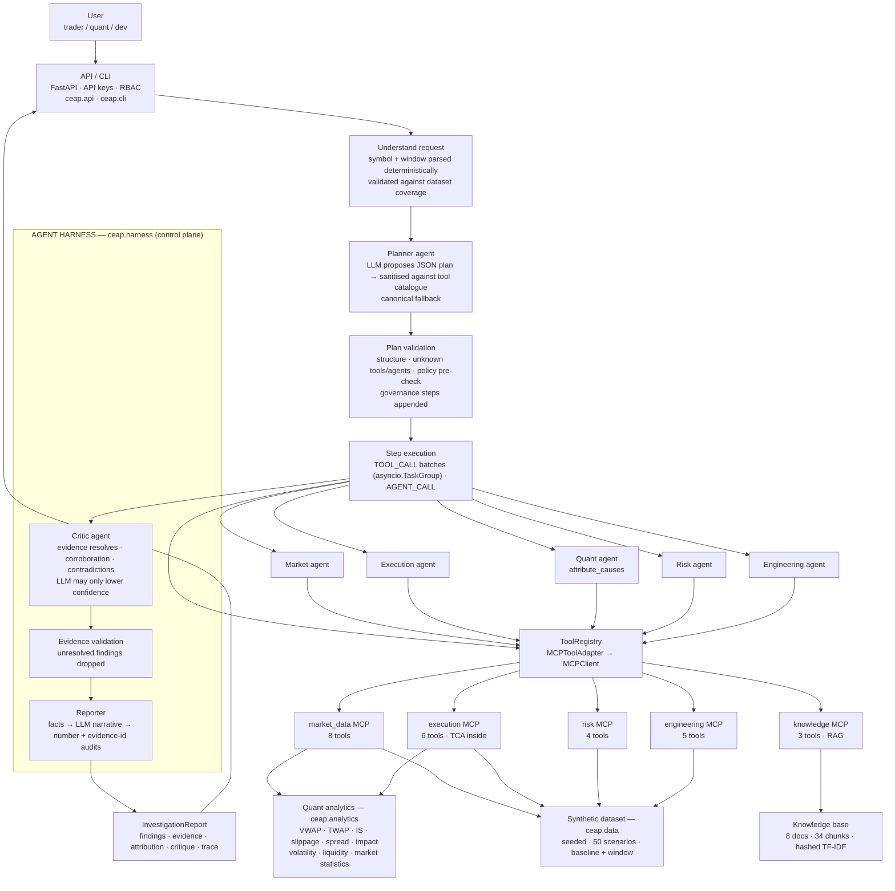
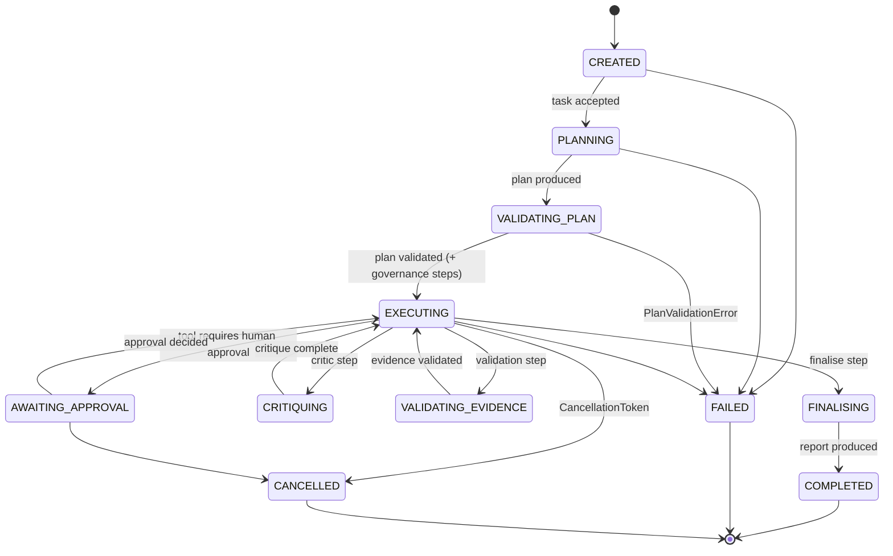
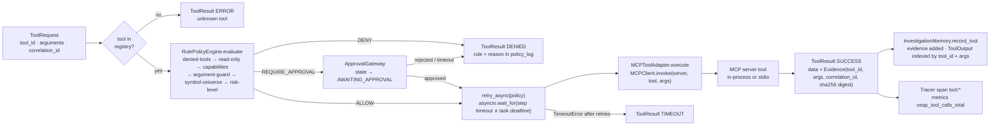
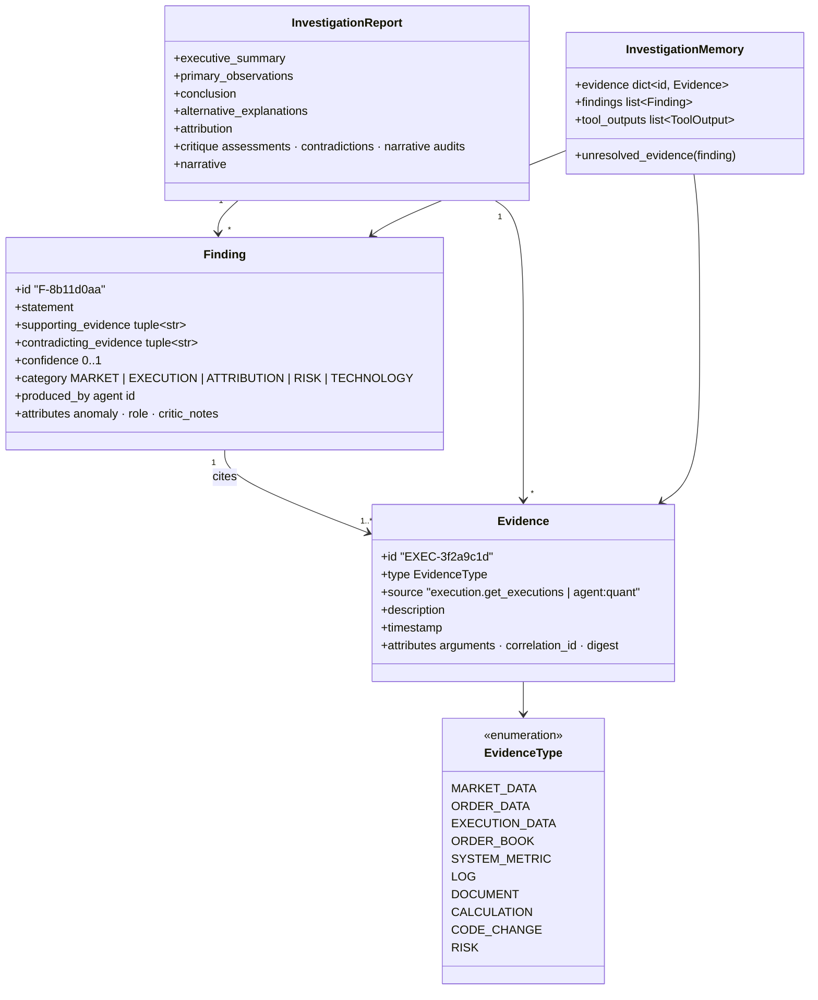
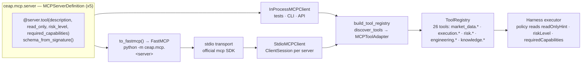
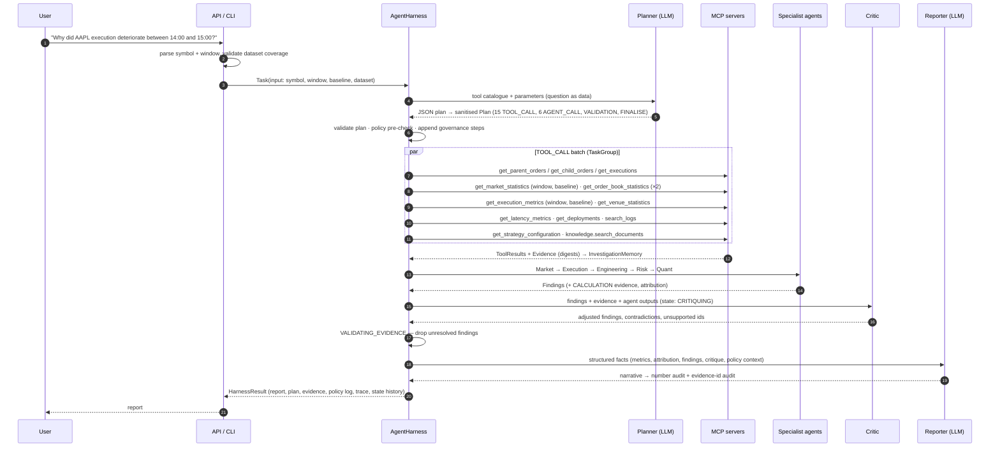
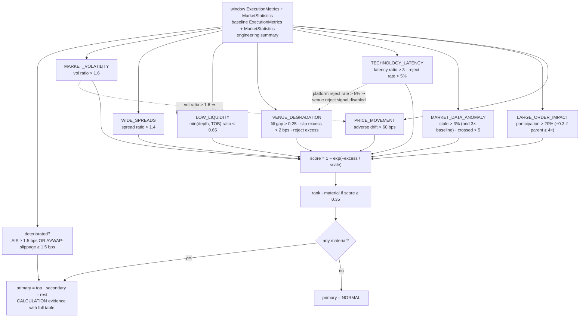
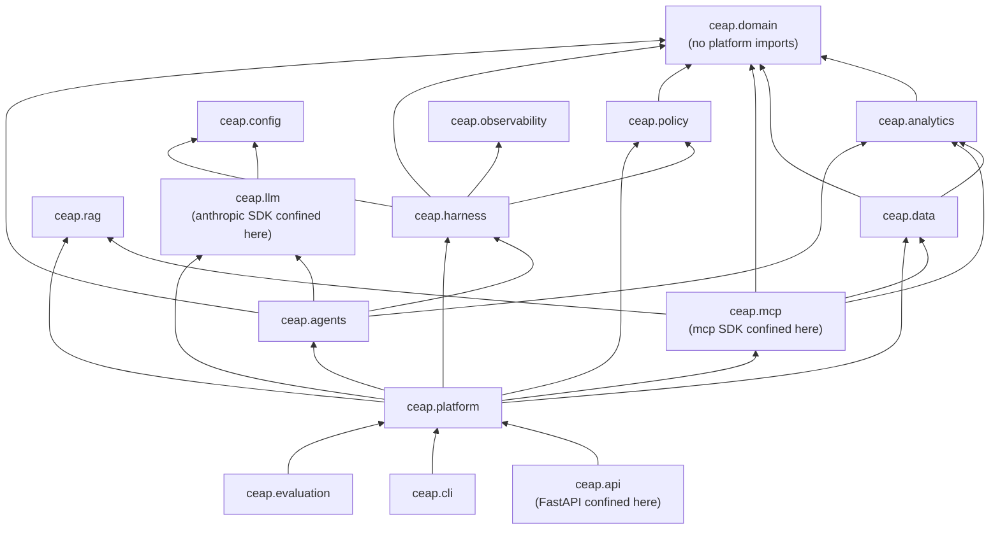
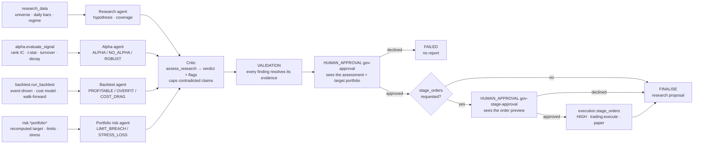

# Architecture diagrams

Every diagram on this page renders natively on GitHub (Mermaid). Names, states, tool counts
and step ids are the repository's actual values — if you rename a module, update the diagram.

Contents: 1. [End-to-end investigation pipeline](#1-end-to-end-investigation-pipeline) ·
2. [Harness state machine](#2-harness-state-machine) · 3. [The path of one tool call](#3-the-path-of-one-tool-call) ·
4. [Evidence and finding model](#4-evidence-and-finding-model) · 5. [MCP topology](#5-mcp-topology) ·
6. [Investigation sequence](#6-investigation-sequence) · 7. [Attribution decision flow](#7-attribution-decision-flow) ·
8. [Package dependencies](#8-package-dependencies) · 9. [Stage 2 extension](#9-stage-2-extension)

## 1. End-to-end investigation pipeline

Solid arrows are data flow. The LLM appears only where reasoning happens (planning,
critique, narrative); every number on the path comes from `ceap.analytics`.

## 2. Harness state machine

`ceap/harness/state_machine.py` — `TRANSITIONS` is the entire legal graph; anything else
raises `InvalidTransition`. `FAILED` and `CANCELLED` are reachable from every non-terminal
state.

## 3. The path of one tool call

`StepExecutor.execute_tool` is the only way a tool runs — for plan steps and for agents'
own calls alike (`HarnessToolInvoker`).

## 4. Evidence and finding model

Every claim in a report is a `Finding`; every `Finding` cites `Evidence` ids that must resolve
in `InvestigationMemory` or the finding is dropped at `VALIDATING_EVIDENCE`.

## 5. MCP topology

One `MCPServerDefinition` per server; the same object answers in-process calls and is exported
to a real `FastMCP` server over stdio. Tool schemas are derived from Python signatures, so the
two representations cannot drift.

## 6. Investigation sequence

The canonical plan for the MVP question, as the deterministic planner emits it (a real model
produces the same shape; unknown tools are stripped).

## 7. Attribution decision flow

`ceap.analytics.attribution.attribute_causes` — thresholds in `Thresholds`, materiality at
0.35. The two guards on the right are the ones the evaluation suite forced into existence.

## 8. Package dependencies

Arrows point from a package to what it imports. `domain` imports nothing from the platform;
`analytics` and `data` depend only on `domain`; the LLM SDK, MCP SDK and FastAPI are each
confined to one package.

## 9. Stage 2: research workflow (realised in 0.3.0)

The research workflow runs on the same harness, policy engine, approval gateway and evidence
model. Tool calls come first (their outputs are cached evidence), the agents interpret them, the
critic computes the deterministic assessment, and the harness owns the governance tail: proposal
approval, then - only when requested and only for a principal with `trading:execute` - a second
approval and the single non-read-only tool, `execution.stage_orders` (paper orders).

